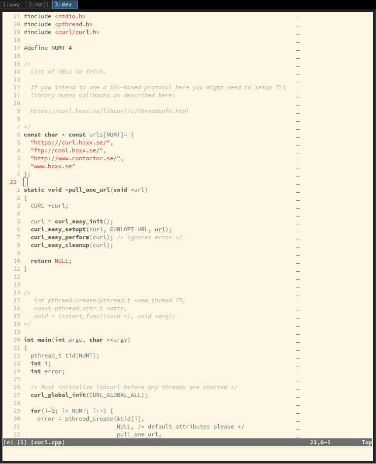
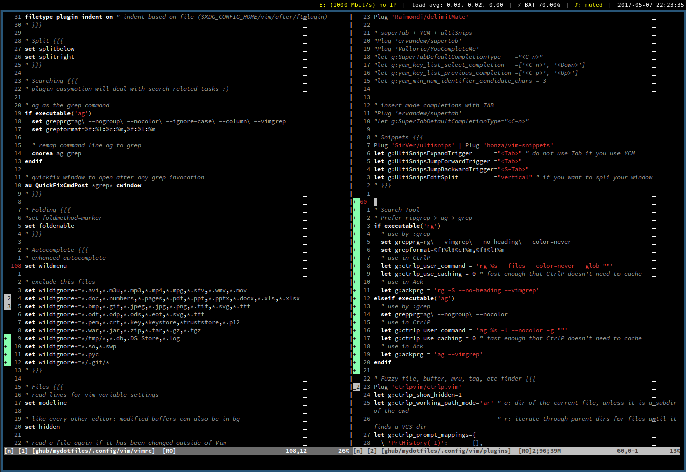

# Wchmb

wchmb is a black and white color scheme for Vim focused on avoiding
distractions.

C/C++:

*Code from [curl](https://curl.haxx.se/)

VimL:

## Features
- Minimal amount of colors
- Very little eye strain
- Different color schemes for light and dark backgrounds.
  You just need to ``set background`` property

## Installation
Add to your .vimrc:

    set t_Co=256
    set background=light
    "set background=dark
    colorscheme wchmb

### Vundle
Add the following to your `~/.vimrc` file and run `PluginInstall` in Vim.

    Plugin 'wachambo/vim-wchmb-color'

### vim-plug
Add the following to your `~/.vimrc` file and run `PlugInstall` in Vim.

    Plug 'wachambo/vim-wchmb-color'

### Pathogen
    cd ~/.vim/bundle
    git clone https://github.com/wachambo/vim-wchmb-color.git

### Manual
Put ``wchmb.vim`` in ~/.vim/colors/
